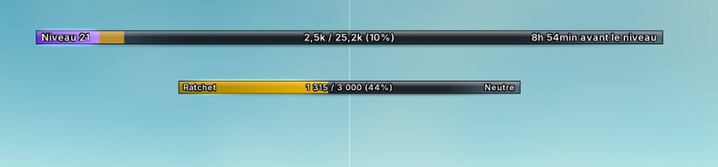
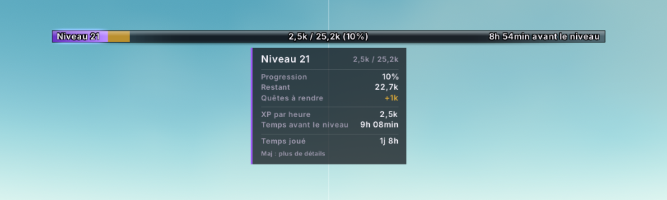
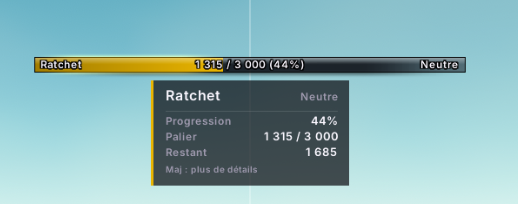
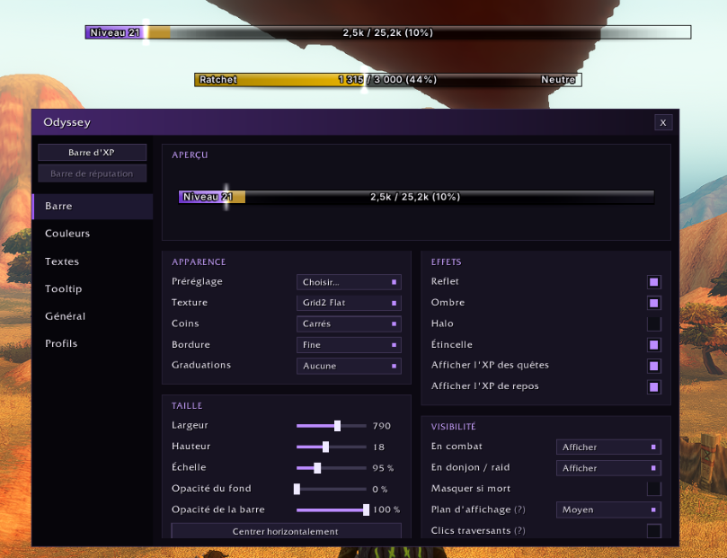
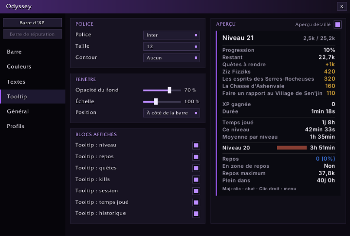
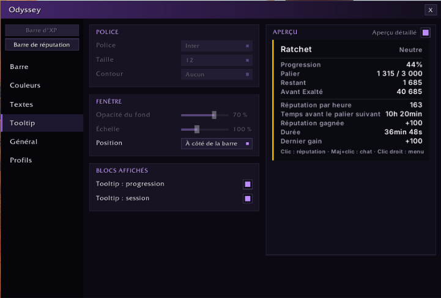

<div align="center">

# ✦ Odyssey

**A beautiful XP & reputation bar — and a leveling companion — for World of Warcraft: Forever (Classic).**

[](#install)
[](#install)
[](#languages)
[](LICENSE)

[Features](#features) · [Install](#install) · [Usage](#usage) · [Settings](#the-settings-window) · [FAQ](#faq) · [Development](#development) · [En français](#en-français)

</div>

---

Odyssey replaces the default experience bar with one you shape to your taste, tells you everything that matters
while you level — without drowning you in numbers — and keeps a history of your journey, level after level.

<p align="center">
  
</p>

## Features

### A bar that looks the way you want
- **Four presets** to start from — *Smooth*, *Segmented*, *Neon*, *Thin line* — then change anything:
  texture, square or rounded corners, border, background and bar opacity, gloss, drop shadow, glow, spark,
  ticks every 10 % or 5 %.
- **Eleven palettes** (Arcane, Royal gold, Emerald, Frost, Ember, Twilight rose, Starry night, Fel, Monochrome,
  class colour, faction) and the game's colour wheel for any element.
- **Your fonts** for the bar and the tooltip: the game's fonts, four bundled open fonts (Nunito, Barlow Condensed,
  Cinzel, Inter) and every font or bar texture other addons share through **LibSharedMedia**.
- **Three text slots** (left, centre, right) inside, above or below the bar: level, percentage, current / max,
  remaining, rested XP, XP per hour, time to level, kills to level, quest XP.
- Rested XP and the XP of **quests ready to turn in** drawn right on the bar.

### A tooltip you can read at a glance

<p align="center">
  
</p>

- The essentials in three short groups: progress, pace, time played.
- Hold **Shift** for everything else: quest-by-quest XP, kills to level, session, time per level and your
  **leveling history** — how long each level took, and how your current pace compares with your own average.

### A reputation bar

<p align="center">
  
</p>
- Follows the faction you watch in the game: standing, progress, remaining, to Exalted, reputation per hour,
  time to the next standing.
- Coloured by standing (like the game) or by your palette; its own position and settings, or the XP bar's style.
- Click it to open the reputation pane, right-click it to watch another faction.

### Made for leveling on Classic
- **"Turn in your quests!"** — a pulse and a chat line when your completed quests are enough to level up.
- **Level-up summary** — the time the level took and your pace against your average.
- **Rested planner** — a lighter rested band in a rest area, the time until rested XP is full (150 %),
  your other characters' estimated rested XP, and a reminder when you log out outside an inn.
- **Shift+click** a bar to put your progress in the chat box, ready to send.

### Out of your way when you need it
- Show the bar only **on mouseover**, or **fade / hide** it in combat or in dungeons, hide it when dead.
- Choose its layer, make it click-through, snap it to the centre of the screen with **positioning guides**.

### Settings that feel like an app
- Odyssey's own **settings window** with live previews of the bar and the tooltip.
- **Profiles** shared between characters: create, copy, rename, reset, delete.
- A per-character **backup** of your leveling history, restored automatically if the main save ever loses it.

## Install

- **CurseForge app:** coming soon — Odyssey will be listed under the *WoW: Forever* game version.
- **Manually:** download this repository (*Code → Download ZIP*), rename the extracted folder to `Odyssey`
  and put it into `World of Warcraft/_classic_beta_/Interface/AddOns/`.

Odyssey has no required dependency.

## Usage

| Action | Result |
|---|---|
| Hover a bar | Tooltip (hold **Shift** for details) |
| **Shift + click** a bar | Puts your progress in the chat box |
| **Click** the reputation bar | Opens the reputation pane |
| **Right-click** a bar | Menu: settings, insert into chat, watch another faction |
| Drag an unlocked bar | Moves it; it snaps to the screen centre (hold **Shift** to move freely) |

| Command | Result |
|---|---|
| `/odyssey` | Opens or closes the settings window |
| `/odyssey unlock` · `/odyssey lock` | Lets you move the bars, then fixes them |
| `/odyssey reset` | Restarts the session figures |
| `/odyssey dump` | Prints what Odyssey currently knows (handy for bug reports) |

## The settings window

<p align="center">
  
</p>

Pick the bar to edit (**XP bar** / **Reputation bar**) at the top of the sidebar, then a section:

- **Bar** — preset, texture, corners, border, ticks, effects, size, opacity, visibility and conditions.
- **Colours** — palette, border colour, custom colours (the reputation bar can use the standing colour).
- **Texts** — the three text slots, their position and font.
- **Tooltip** — font, opacity, scale, position and the blocks to show, with a live preview.
- **General** — lock, the default XP bar, max-level behaviour, alerts, session and history data.
- **Profiles** — the profile this character uses, and profile management.

Options marked **(?)** explain themselves when you hover their name.

<p align="center">
  
  
</p>

## FAQ

**The default reputation bar disappeared.**
On this client the default XP and reputation bars live in the same frame, so *Hide Blizzard XP bar* hides both.
Odyssey's own reputation bar takes over; untick the option to get the default ones back.

**The reputation bar does not show.**
Tick *Show as experience bar* on a faction in the game's reputation pane, or right-click the bar and pick one.

**The leveling history is empty.**
It starts when Odyssey is installed: each level is recorded when you complete it.

**Can I use Odyssey on another Classic version?**
It is built and tested for WoW: Forever (interface 16001). Other clients may work but are not supported yet.

## Languages

English and French. Every string goes through a translation table (`Locales/`); new languages are welcome.

## Development

```sh
luajit tests/run.lua            # unit tests (pure logic, syntax, unknown globals and fields)
python3 tools/make_textures.py  # regenerate the bar textures
tools/fetch_fonts.sh            # download the bundled open fonts with their licences
```

- Pure modules (`Calc`, `History`, `Sources/`, `Texts`, `TooltipContent`, `Profiles`, …) take their inputs as
  arguments and are tested outside the game; the frames (`Bar`, `Tooltip`, `Options`) stay thin.
- Every client API is feature-tested before use; `/odyssey probe` records which ones exist on a client.
- Design notes and implementation plans live in [`docs/superpowers/`](docs/superpowers/).

Bug reports and ideas: [open an issue](https://github.com/GaelleBriet/Odyssey/issues) — the output of
`/odyssey dump` helps a lot.

## Credits & license

- Code: [MIT](LICENSE).
- Bundled fonts: Nunito, Barlow Condensed, Cinzel and Inter, under the SIL Open Font License
  (licence files in [`Media/Fonts/`](Media/Fonts/)).
- No file from Blizzard's interface is included.

---

## En français

**Odyssey** remplace la barre d'XP du jeu par une barre que tu personnalises entièrement, ajoute une barre de
réputation, et t'accompagne pendant ton leveling sur **WoW: Forever**.

- **Apparence** : 4 préréglages, 11 palettes, textures et polices au choix (y compris celles de LibSharedMedia),
  coins, bordure, opacités, reflet, ombre, halo, graduations, trois textes au choix.
- **Tooltip** : l'essentiel en un coup d'œil, tout le détail avec **Maj** (quêtes une par une, session,
  historique de leveling et rythme comparé à ta moyenne).
- **Réputation** : la faction suivie, son palier, ce qu'il reste jusqu'au palier suivant et jusqu'à Exalté.
- **Leveling** : alerte quand tes quêtes terminées suffisent pour monter, résumé à chaque niveau, planificateur
  de repos avec tes autres personnages, Maj+clic pour mettre ta progression dans le chat.
- **Discrétion** : affichage au survol, en combat ou en donjon estompé ou masqué, guides de positionnement.
- **Réglages** : une fenêtre dédiée avec aperçus en direct, et des **profils** partagés entre personnages.

Commande principale : `/odyssey`. L'addon est entièrement traduit en français.
